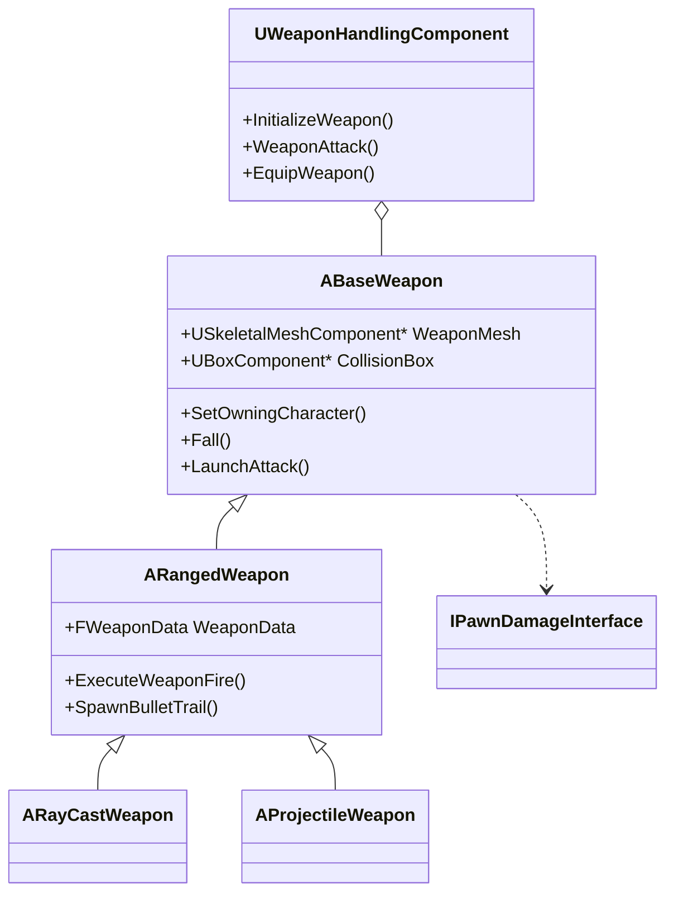

Here's a comprehensive GitHub-style README for your Weapon Handling Module:

# 🔫 Weapon Handling Module for Unreal Engine

[](https://unrealengine.com/)
[](LICENSE)

A modular weapon system for Unreal Engine that provides a flexible framework for implementing various weapon types with consistent behavior and extensible architecture.

## 📑 Table of Contents
- [🌟 Overview](#-overview)
- [⚡ Quickstart](#-quickstart)
- [✨ Features](#-features)
- [🏗️ Project Structure](#️-project-structure)
- [📂 Project Index](#-project-index)
- [📚 Full Documentation](#-full-documentation)
- [🤝 Contributing](#-contributing)
- [📜 License](#-license)

## 🌟 Overview

The Weapon Handling Module provides a comprehensive solution for implementing weapons in Unreal Engine, featuring:

- Hierarchical weapon class structure
- Support for multiple weapon types (ranged, melee, projectile)
- Configurable firing modes and patterns
- Physics-based weapon dropping
- Damage attribution system
- Visual/audio feedback integration



## ⚡ Quickstart

1. **Add to your project**:
   ```cpp
   // In YourCharacter.h
   UPROPERTY(VisibleAnywhere, BlueprintReadOnly, Category = "Components")
   UWeaponHandlingComponent* WeaponHandler;
   ```

2. **Configure input**:
   ```cpp
   // In character setup
   WeaponHandler = CreateDefaultSubobject<UWeaponHandlingComponent>(TEXT("WeaponHandler"));
   ```

3. **Create a weapon blueprint**:
   - Inherit from `ARayCastWeapon` or `AProjectileWeapon`
   - Configure `WeaponData` properties

4. **Equip and fire**:
   ```cpp
   // Blueprint or C++ call
   WeaponHandler->EquipWeapon();
   WeaponHandler->WeaponAttack();
   ```

## ✨ Features

### 🏹 Core Weapon Types
| Type | Class | Description |
|------|-------|-------------|
| Base | `ABaseWeapon` | Foundation for all weapons |
| Ranged | `ARangedWeapon` | Abstract base for ranged weapons |
| Raycast | `ARayCastWeapon` | Instant-hit weapons |
| Projectile | `AProjectileWeapon` | Physical projectile weapons |

### 🔫 Firing Modes
```cpp
enum class EFiringMode {
    EFM_Single,    // Precision single shots
    EFM_Burst,     // Controlled burst fire
    EFM_Automatic  // Sustained automatic fire
};
```

### 🎯 Shot Patterns
```cpp
enum class EShotPattern {
    ESP_Single,  // Single accurate shot
    ESP_Spread   // Scatter shot pattern
};
```

### 📊 Weapon Data Configuration
The `FWeaponData` struct provides **data-driven weapon configuration** through these categorized properties:

#### 🔥 Firing Mechanics
| Property | Type | Description | Condition |
|----------|------|-------------|-----------|
| `FiringMode` | `EFiringMode` | Tactical firing behavior (Single/Burst/Auto) | - |
| `WeaponFireRate` | `float` | Minimum delay between shots (seconds) | - |
| `MaxBurstShotCount` | `uint8` | Shots per burst sequence | Only when `FiringMode == EFM_Burst` |
| `BurstShotCooldown` | `float` | Recovery period between bursts (seconds) | Only when `FiringMode == EFM_Burst` |

#### 💥 Combat Parameters
| Property | Type | Description |
|----------|------|-------------|
| `WeaponRange` | `float` | Maximum effective range (cm) |
| `WeaponDamage` | `float` | Base damage per hit |
| `bShouldPerformWeaponTraceTest` | `bool` | Enables barrel-origin hit detection |

#### 🎯 Shot Characteristics
| Property | Type | Description | Condition |
|----------|------|-------------|-----------|
| `ShotPattern` | `EShotPattern` | Projectile distribution (Single/Spread) | - |
| `PelletsPerBullet` | `int` | Projectiles per trigger pull | Only when `ShotPattern == ESP_Spread` |
| `MinimumSpreadRange` | `float` | Minimum spread angle (degrees) | Only when `ShotPattern == ESP_Spread` |
| `MaximumSpreadRange` | `float` | Maximum spread angle (degrees) | Only when `ShotPattern == ESP_Spread` |

#### ✨ Visual Feedback
| Property | Type | Description |
|----------|------|-------------|
| `MuzzleFlash` | `UParticleSystem*` | Muzzle discharge effect |
| `BeamTrail` | `UParticleSystem*` | Projectile trail effect |
| `ImpactParticle` | `UParticleSystem*` | Surface impact effect |

#### 🔊 Audio Feedback
| Property | Type | Description |
|----------|------|-------------|
| `WeaponFireSound` | `USoundBase*` | Discharge sound signature |

#### 🎚️ Ammunition
| Property | Type | Description | Access |
|----------|------|-------------|--------|
| `CurrentAmmoCount` | `int32` | Available ammunition | BlueprintReadOnly |
| `MaxAmmoCount` | `int32` | Maximum ammo capacity | Editable |
| `CurrentClipCount` | `int32` | Rounds in active clip | BlueprintReadOnly |
| `MaxClipCount` | `int32` | Maximum clip capacity | Editable |

#### Example Configuration (C++)
```cpp
// Create and configure a burst-fire shotgun
FWeaponData ShotgunData;
ShotgunData.FiringMode = EFiringMode::EFM_Burst;
ShotgunData.WeaponFireRate = 0.3f;
ShotgunData.MaxBurstShotCount = 3;
ShotgunData.ShotPattern = EShotPattern::ESP_Spread;
ShotgunData.PelletsPerBullet = 8;
ShotgunData.WeaponDamage = 10.0f; // Damage per pellet
```


## 🏗️ Project Structure

```
WeaponHandlingModule/
├── Component/
│   └── WeaponHandlingComponent.*    # Main weapon management component
├── Interfaces/
│   └── PawnDamageInterface.*        # Damage application interface
└── Weapon/
    ├── BaseWeapon.*                 # Foundation weapon class
    ├── RangedWeapon.*               # Abstract ranged weapon
    ├── RayCastWeapon.*              # Hit-scan implementation
    └── ProjectileWeapon.*           # Physical projectile weapon
```

## 📂 Project Index

### Core Classes
| Class | Description |
|-------|-------------|
| `ABaseWeapon` | Root weapon class with ownership and collision |
| `ARangedWeapon` | Implements firing modes and visual effects |
| `ARayCastWeapon` | Hit-scan weapon with precise traces |
| `AProjectileWeapon` | Physical projectile weapon |
| `UWeaponHandlingComponent` | Manages weapon equipping and input |

### Key Interfaces
| Interface | Purpose |
|-----------|---------|
| `IPawnDamageInterface` | Standardized damage application |

## 📚 Full Documentation

### ABaseWeapon
The foundational Actor class for all weapons, providing:

#### Core Components
- `CollisionBox`: Root collision component
- `WeaponMesh`: Visual representation

#### Key Methods
```cpp
// Ownership management
void SetOwningCharacter(ACharacter* NewOwner);

// Physics handling
void Fall();

// Collision control
void AddActorToIgnore(AActor* IgnoredActor);
void AddActorToIgnore(TArray<AActor*> IgnoredActors);

// Attack interface
virtual void LaunchAttack(FHitResult& WeaponAttackHitResult, AController* InstigatorController);
```

### UWeaponHandlingComponent
The central management system for character weapons:

#### Primary Functions
```cpp
// Weapon control
void EquipWeapon();
void UnequipWeapon();
void WeaponAttack();

// Initialization
void InitializeWeapon(ABaseWeapon* NewWeapon);
void InitializeWeaponHandlingComponent();
```

#### Configuration
```cpp
// Input
UPROPERTY(EditAnywhere)
UInputAction* FireWeaponAction;

// Attachment
UPROPERTY(EditAnywhere)
FName WeaponAttachmentSocket;
```

## 🤝 Contributing

1. Fork the project
2. Create your feature branch (`git checkout -b feature/AmazingFeature`)
3. Commit your changes (`git commit -m 'Add some amazing feature'`)
4. Push to the branch (`git push origin feature/AmazingFeature`)
5. Open a Pull Request

## 📜 License

Distributed under the MIT License. See `LICENSE` for more information.

